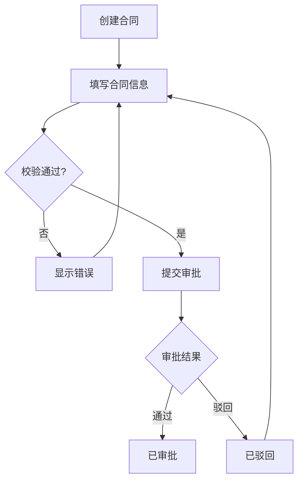
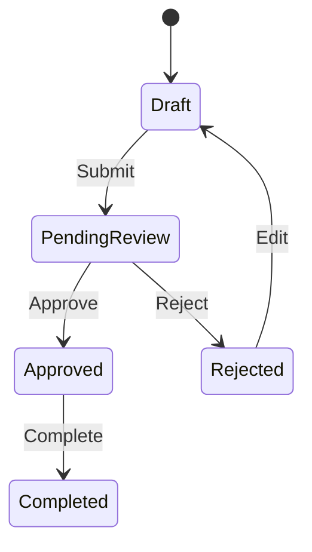

# Detailed Software PRD Skill

一个用于生成**详细软件需求文档（PRD / SRS）**的 Skill。

它可以把产品想法、业务需求、会议纪要、功能清单或现有系统说明，整理成一份结构完整、可开发、可测试、可验收的软件需求说明书。

支持：

- Mermaid 功能架构图
- Mermaid 信息架构图
- Mermaid 页面关系图
- Mermaid 业务流程图
- Mermaid 状态机
- ASCII 低保真页面原型
- 页面字段说明
- 查询 / 筛选 / 列表规则
- 按钮与操作说明
- 页面交互逻辑
- 页面跳转关系
- 用户角色与权限
- 业务规则
- 异常与边界场景
- 数据模型
- 消息通知
- 日志与审计
- 非功能性需求
- Given / When / Then 验收标准

---

## 适用场景

适合用于生成或整理：

- Web 系统
- App
- 小程序
- SaaS
- 后台管理系统
- CRM
- ERP
- OMS
- WMS
- 电商系统
- 社交产品
- 预约系统
- 审批系统
- 合同管理系统
- 企业内部管理系统

也可以用于把一段比较模糊的产品想法，逐步扩展成完整需求文档。

例如输入：

```text
我想做一个企业合同管理系统。

需要支持合同创建、审批、签署、归档和到期提醒。
销售只能看自己的合同，销售主管能看部门合同，管理员能看全部。
```

Skill 会进一步整理：

```text
产品目标
↓
用户角色
↓
合同业务对象
↓
功能架构
↓
信息架构
↓
业务流程
↓
状态机
↓
页面清单
↓
逐页面 ASCII 原型
↓
字段 / 按钮 / 交互
↓
权限 / 业务规则
↓
异常场景
↓
验收标准
```

---

# 核心特点

## 1. 不只是“写一份 PRD”

本 Skill 不只输出功能名称。

对于每一个重要功能，会尽量说明：

- 谁可以操作
- 从哪里进入
- 前置条件
- 页面有哪些内容
- 输入哪些字段
- 字段如何校验
- 点击按钮后发生什么
- 数据如何变化
- 状态如何变化
- 成功如何反馈
- 失败如何处理
- 权限如何限制
- 是否记录日志
- 如何验收

目标是让文档能够直接服务于：

- 产品设计
- UI / UX
- 前端开发
- 后端开发
- 测试
- 项目评审
- 需求验收

---

## 2. Mermaid 表达架构和流程

以下内容优先使用 Mermaid：

- 产品功能架构
- 信息架构
- 页面 Sitemap
- 页面跳转关系
- 用户流程
- 核心业务流程
- 审批流程
- 订单流程
- 支付流程
- 状态机
- 模块关系
- 数据实体关系

示例：



---

## 3. ASCII 直接绘制低保真页面原型

页面 UI 不使用 Mermaid。

页面、弹窗、Drawer、表单、列表、Empty State、Error State 等统一使用 ASCII Wireframe。

示例：

```text
┌──────────────────────────────────────────────────────────────────────┐
│ Logo                  Customer Management              🔔   Admin ▼ │
├──────────────┬───────────────────────────────────────────────────────┤
│ Dashboard    │ ① Customer Management / Customer List                │
│ Customer ●   │                                                       │
│ Order        │ ┌───────────────────────────────────────────────────┐ │
│ Warehouse    │ │ ② Search & Filter                                │ │
│ Settings     │ │ Customer [________________]                       │ │
│              │ │ Status [All ▼] Owner [All ▼] [Reset] [Search]    │ │
│              │ └───────────────────────────────────────────────────┘ │
│              │                                                       │
│              │ ③ [+ Add Customer] [Import] [Export]                │
│              │                                                       │
│              │ ④ Customer List                                      │
│              │ ┌──┬──────────┬────────────┬──────┬──────┬────────┐ │
│              │ │□ │ Customer │ Phone      │Status│Owner │Actions │ │
│              │ ├──┼──────────┼────────────┼──────┼──────┼────────┤ │
│              │ │□ │ ABC Ltd. │138****001  │Active│Zhang │View    │ │
│              │ │□ │ XYZ Ltd. │139****002  │Active│Li    │Edit    │ │
│              │ └──┴──────────┴────────────┴──────┴──────┴────────┘ │
│              │                                                       │
│              │ ⑤ Selected: 0             ⑥ < 1 2 3 ... 10 >        │
└──────────────┴───────────────────────────────────────────────────────┘
```

原型中的编号会继续对应页面区域说明、字段说明、按钮说明和交互逻辑。

---

## 4. 页面级需求标准化

每个主要页面默认包含：

1. 页面基本信息
2. 页面入口
3. 输入 / 前置条件
4. ASCII 原型
5. 页面布局 / 区域说明
6. 页面功能
7. 字段说明
8. 查询 / 筛选条件
9. 列表字段
10. 按钮与操作
11. 页面逻辑与交互
12. 页面跳转
13. 页面状态
14. 权限规则
15. 业务规则
16. 异常与边界
17. 验收标准

避免出现：

> “这个页面支持新增、编辑、删除。”

这种无法直接指导研发和测试的模糊描述。

---

## 5. 权限与数据范围

对于企业软件，会进一步区分：

- 页面权限
- 操作权限
- 数据权限
- 字段权限
- 审批权限
- 状态操作权限

例如：

```text
销售：
只能查看自己负责的客户。

销售主管：
可以查看本部门客户。

管理员：
可以查看全部客户。
```

---

## 6. 状态机

对于具有生命周期的业务对象，例如：

- 订单
- 合同
- 审批单
- 工单
- 任务
- 发货单
- 库存单

会生成状态图和状态流转表。

示例：



---

## 7. 验收标准

核心功能会尽量生成 Given / When / Then 格式的验收标准。

例如：

```text
AC-P023-001 查询客户成功

Given

用户已经登录并拥有客户查看权限。

When

用户输入客户名称并点击“查询”。

Then

系统只展示符合查询条件且位于当前用户数据权限范围内的客户。
```

---

# 文档默认结构

生成的 PRD / SRS 默认采用以下目录：

```text
01 文档综述
02 产品需求
03 产品架构
04 产品流程
05 产品全局说明
06 页面清单
07 产品原型及页面详细需求
08 跨页面功能详细需求
09 业务对象状态机
10 权限模型
11 数据模型
12 消息与通知
13 日志与审计
14 非功能性需求
15 特定场景与业务约束
16 Open Questions / 待确认事项
17 版本规划
```

---

# 编号体系

推荐使用以下编号：

```text
MOD-03          客户管理模块
FR-03-001       查询客户
FR-03-002       新增客户

P-023           客户列表页
P-024           新增客户页

BR-P023-001     页面业务规则
INT-P023-001    页面交互
AC-P023-001     验收标准
```

这样功能、页面、规则、交互和测试之间可以相互追踪。

---

# 使用方式

本仓库的核心文件是：

```text
SKILL.md
```

在支持 Skill 的 Agent / AI 环境中加载该文件即可使用。

建议输入尽量包含：

```text
产品名称：
产品类型：
产品目标：
目标用户：
用户角色：
核心业务：
已有功能：
特殊规则：
权限规则：
本期范围：
```

如果信息不完整也可以直接输入自然语言需求。

例如：

```text
帮我设计一个物业报修系统。

住户可以提交报修，物业客服负责派单，维修师傅接单并处理。
维修完成后住户可以评价。

需要同时有住户端和物业管理后台。
```

Skill 会主动识别：

- 用户角色
- 业务对象
- 核心流程
- 页面
- 状态
- 权限
- 异常
- 待确认问题

---

# 推荐仓库结构

当前最简单：

```text
detailed-software-prd-skill/
├── README.md
└── SKILL.md
```

后续可以扩展：

```text
detailed-software-prd-skill/
├── README.md
├── SKILL.md
│
├── examples/
│   ├── crm-input.md
│   ├── crm-output.md
│   ├── ecommerce-input.md
│   └── ecommerce-output.md
│
└── templates/
    └── prd-template.md
```

---

# 设计原则

本 Skill 强调：

> Mermaid 管业务逻辑，ASCII 管页面视觉结构，正文管详细需求规则。

同时要求：

- Mermaid 与正文一致
- ASCII 原型与正文一致
- 页面清单与页面详情一致
- 状态机与业务规则一致
- 验收标准覆盖核心功能

如果发现不一致，应优先修正文档，而不是直接输出。

---

# 已知限制

本 Skill 生成的是需求分析和低保真原型。

它不能替代：

- 完整 UI 视觉设计
- 高保真 Figma 原型
- 技术架构设计
- 数据库详细设计
- API 接口文档
- 安全审计
- 性能压测
- 最终业务确认

对于没有明确提供的重要业务规则，Skill 应将其标记为：

```text
【推断】
【建议补充】
【待确认】
```

而不是把猜测写成确定需求。

---

# 后续计划

后续可以继续增加：

- [ ] 完整 CRM 示例
- [ ] 完整电商系统示例
- [ ] 完整后台管理系统示例
- [ ] API 需求模板
- [ ] 数据库需求模板
- [ ] 测试用例生成规则
- [ ] 用户故事 / Use Case 模板
- [ ] 需求变更记录模板
- [ ] 多版本需求差异分析

---

# License

当前仓库如未配置 License，则默认保留全部权利。

如果计划公开给其他人使用，建议后续根据实际需求添加合适的开源许可证。
