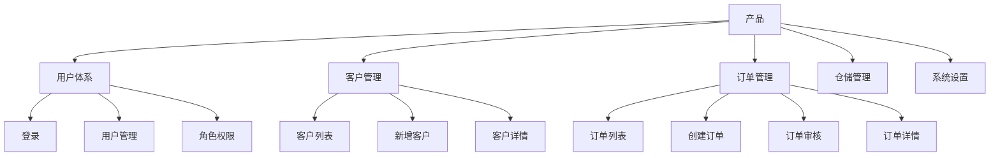
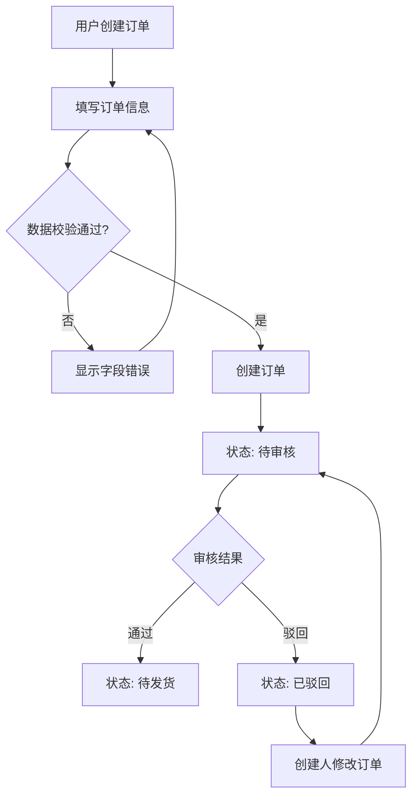
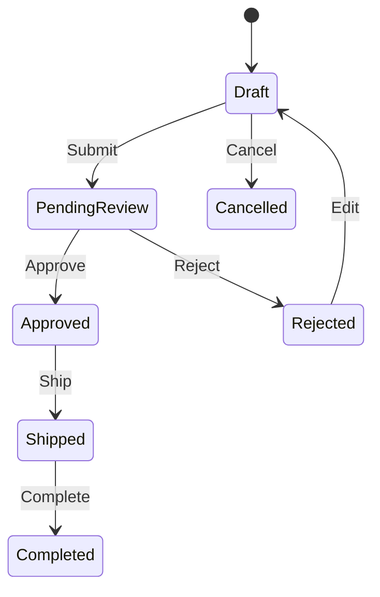

# Detailed Software PRD / SRS Generator

## 1. Skill 目标

本 Skill 用于把模糊、零散或已有的软件需求，整理成一份**结构完整、粒度统一、可直接用于产品设计、UI/UX、前端、后端、测试和项目验收**的软件需求说明书。

最终文档应做到：

- 能说明为什么做、给谁用、解决什么问题
- 能说明系统由哪些模块、页面、角色、流程构成
- 能说明每一个页面有什么、怎么操作、如何跳转
- 能说明字段、按钮、列表、状态、权限、异常和边界条件
- 能说明关键业务对象的状态变化
- 能形成可测试的验收标准
- 能用 Mermaid 表达结构和流程
- 能用 ASCII Wireframe 表达页面低保真原型
- 能区分用户已明确需求、合理推断、建议补充和待确认事项

---

# 2. 适用场景

当用户要求以下任务时使用本 Skill：

- 编写 PRD
- 编写产品需求文档
- 编写软件需求说明书
- 编写软件需求规格说明书
- 编写 SRS
- 将产品想法整理成完整需求
- 将业务流程转化为软件需求
- 梳理系统页面
- 生成页面原型
- 生成后台管理系统需求
- 生成 App / Web / 小程序 / SaaS 需求
- 生成 CRM / ERP / OMS / WMS / 电商 / 社交 / 预约 / 审批等系统需求
- 从已有需求文档中补全页面、规则、流程、权限或验收标准

---

# 3. 核心原则

## 3.1 需求必须可开发、可测试

禁止仅写：

> 用户可以创建订单。

应明确：

- 谁可以操作
- 从哪里进入
- 前置条件是什么
- 用户填写什么
- 系统校验什么
- 点击后系统做什么
- 数据如何变化
- 状态如何变化
- 成功后发生什么
- 失败后发生什么
- 是否触发通知
- 是否记录日志
- 是否跳转页面

---

## 3.2 不把推测写成事实

用户明确提供的信息，直接写入需求。

根据上下文合理补充的信息，必须标记为：

- 【推断】
- 【建议补充】
- 【待确认】

重要业务事实无法确定时，不得擅自决定。

应进入：

`Open Questions / 待确认事项`

---

## 3.3 文档按照“业务 → 流程 → 页面 → 规则 → 验收”展开

默认推导顺序：

```text
产品背景与目标
        ↓
用户与角色
        ↓
核心业务对象
        ↓
需求汇总
        ↓
功能架构
        ↓
信息架构
        ↓
核心业务流程
        ↓
页面清单
        ↓
逐页面详细需求
        ↓
业务规则
        ↓
状态机
        ↓
权限模型
        ↓
异常与边界
        ↓
非功能需求
        ↓
验收标准
        ↓
完整性检查
```

---

# 4. 输入分析规则

开始输出正式 PRD 前，先识别以下内容。

## 4.1 产品基本信息

尽可能识别：

- 产品名称
- 产品类型
- Web / App / 小程序 / Desktop / SaaS / 管理后台
- 产品定位
- 产品背景
- 产品目标
- 当前业务问题
- 使用环境
- 目标用户
- 当前版本
- 本期范围
- 本期不做范围
- 外部系统依赖

没有明确的信息不要强行补齐。

---

## 4.2 用户与角色

识别系统中所有相关角色，例如：

- 游客
- 注册用户
- 普通用户
- 会员
- 企业员工
- 销售
- 销售主管
- 财务
- 客服
- 仓库人员
- 审核人员
- 商家
- 配送员
- 管理员
- 超级管理员

对每个角色考虑：

- 页面访问权限
- 操作权限
- 数据范围
- 字段权限
- 审批权限
- 状态操作权限

---

## 4.3 核心业务对象

识别系统中的核心实体，例如：

- User
- Customer
- Product
- Order
- Payment
- Inventory
- Warehouse
- Shipment
- Contract
- Task
- Approval
- Post
- Comment
- Message

若某对象存在生命周期，后续必须生成状态机。

---

# 5. 图表选择规则

## 5.1 Mermaid 用途

以下内容优先使用 Mermaid：

- 产品功能架构
- 信息架构
- 页面 Sitemap
- 页面跳转关系
- 用户流程
- 核心业务流程
- 审批流程
- 订单流程
- 支付流程
- 状态机
- 角色关系
- 模块关系
- 数据实体关系

## 5.2 ASCII Wireframe 用途

以下内容使用 ASCII / Unicode 文本原型：

- Page
- Modal
- Drawer
- Form
- List
- Table
- Tab
- Wizard
- Empty State
- Loading State
- Error State
- Permission State

## 5.3 禁止混用

- 不使用 Mermaid 模拟页面 UI
- 不使用大型 ASCII 图表达复杂业务流程
- 业务逻辑用 Mermaid
- 页面布局用 ASCII Wireframe

---

# 6. Mermaid 规范

## 6.1 基本要求

1. Mermaid 图必须放在 `mermaid` 代码块中。
2. 节点必须使用明确业务名称。
3. 不使用无意义的 A、B、C 作为最终展示名称。
4. 判断节点必须体现分支条件。
5. 关键失败路径应同时画出。
6. 重要流程不能只有 Happy Path。
7. 图后必须补充文字规则说明。
8. Mermaid 图与正文需求必须一致。
9. 图中的关键节点必须能在后续功能或页面需求中找到对应说明。
10. 不确定节点标记“待确认”。

---

## 6.2 产品功能架构示例



---

## 6.3 业务流程示例



Mermaid 后必须继续写：

### 流程规则

1. 创建成功后订单进入待审核。
2. 只有拥有审核权限的角色可以审核。
3. 驳回必须填写原因。
4. 已驳回订单允许修改并重新提交。

---

## 6.4 状态机示例



状态图后必须输出状态表：

| 当前状态 | 操作 | 条件 | 下一状态 | 操作角色 | 系统动作 |
|---|---|---|---|---|---|

---

# 7. ASCII Wireframe 规范

## 7.1 基本要求

每个主要页面必须至少提供一个 ASCII 原型。

重要的：

- Modal
- Drawer
- Wizard
- Empty State
- Error State
- 差异明显的业务状态

应单独绘制。

原型必须做到：

- 能看出页面的大体布局
- 能看出主要区域之间的位置关系
- 能看出按钮、字段、筛选器、Tab、表格、分页等
- 重要区域使用数字编号
- 编号必须和下方“页面区域说明”一一对应

---

## 7.2 推荐符号

可使用：

- `┌ ┐ └ ┘`
- `├ ┤`
- `│`
- `─`
- `[Button]`
- `[Input____________]`
- `[Select ▼]`
- `( ) Radio`
- `[x] Checkbox`
- `● Active`
- `○ Inactive`

ASCII 原型用于表达信息结构，不追求像素级视觉还原。

---

## 7.3 页面原型示例

```text
┌──────────────────────────────────────────────────────────────────────┐
│ Logo                  Customer Management              🔔   Admin ▼ │
├──────────────┬───────────────────────────────────────────────────────┤
│ Dashboard    │ ① Customer Management / Customer List                │
│ Customer ●  │                                                       │
│ Order        │ ┌───────────────────────────────────────────────────┐ │
│ Warehouse    │ │ ② Search & Filter                                │ │
│ Finance      │ │ Customer Name [________________]                  │ │
│ Settings     │ │ Phone         [________________]                  │ │
│              │ │ Status [All ▼] Owner [All ▼] [Reset] [Search]    │ │
│              │ └───────────────────────────────────────────────────┘ │
│              │                                                       │
│              │ ③ [+ Add Customer] [Import] [Export]                │
│              │                                                       │
│              │ ④ Customer List                                      │
│              │ ┌──┬──────────┬────────────┬──────┬──────┬────────┐ │
│              │ │□ │ Customer │ Phone      │Status│Owner │Actions │ │
│              │ ├──┼──────────┼────────────┼──────┼──────┼────────┤ │
│              │ │□ │ ABC Ltd. │138****001  │Active│Zhang │View    │ │
│              │ │□ │ XYZ Ltd. │139****002  │Active│Li    │Edit    │ │
│              │ └──┴──────────┴────────────┴──────┴──────┴────────┘ │
│              │                                                       │
│              │ ⑤ Selected: 0             ⑥ < 1 2 3 ... 10 >        │
└──────────────┴───────────────────────────────────────────────────────┘
```

---

## 7.4 弹窗示例

```text
┌──────────────────────────────────────────────┐
│ Delete Customer                         ×   │
├──────────────────────────────────────────────┤
│                                              │
│ Are you sure you want to delete this        │
│ customer?                                    │
│                                              │
│ Customer: ABC Ltd.                           │
│                                              │
│ This operation cannot be undone.             │
│                                              │
├──────────────────────────────────────────────┤
│                     [Cancel] [Delete]        │
└──────────────────────────────────────────────┘
```

---

# 8. 标准输出目录

最终需求说明书默认采用以下结构。

# 01 文档综述

## 1.1 文档属性

| 项目 | 内容 |
|---|---|
| 文档名称 | |
| 产品名称 | |
| 文档版本 | V1.0 |
| 文档状态 | 草稿 / 评审中 / 已确认 |
| 创建日期 | |
| 最后更新 | |
| 作者 | |
| 目标读者 | 产品 / UIUX / 前端 / 后端 / 测试 / 项目管理 |

## 1.2 版本修订记录

| 日期 | 版本 | 章节 | 修改内容 | 修改人 |
|---|---|---|---|---|

## 1.3 产品简介

## 1.4 产品定位

## 1.5 产品目标

## 1.6 说明书阅读对象

## 1.7 参考资料

---

# 02 产品需求

## 2.1 产品背景

## 2.2 用户需求分析

| 编号 | 使用场景 | 用户问题 | 用户需求 | 对应模块 |
|---|---|---|---|---|

## 2.3 目标用户

## 2.4 用户角色

| 角色 | 角色说明 | 核心目标 | 主要权限 |
|---|---|---|---|

## 2.5 需求汇总

| 编号 | 需求 | 功能模块 | 优先级 | 备注 |
|---|---|---|---|---|

优先级建议：

- P0：核心必需
- P1：重要
- P2：增强
- P3：后续

## 2.6 产品范围

### 本期包含

### 本期不包含

## 2.7 待确认事项

---

# 03 产品架构

## 3.1 产品功能架构

必须使用 Mermaid。

## 3.2 产品信息架构

必须使用 Mermaid。

## 3.3 页面架构 / Sitemap

优先使用 Mermaid。

## 3.4 功能清单

| 功能编号 | 一级模块 | 二级模块 | 功能名称 | 功能说明 | 优先级 |
|---|---|---|---|---|---|

编号建议：

- `MOD-01`
- `FR-01-001`

---

# 04 产品流程

所有核心流程使用 Mermaid。

至少检查是否需要：

- 登录 / 注册
- 核心业务主流程
- 下单
- 支付
- 审批
- 发货
- 退货
- 库存
- 预约
- 发布
- 结算

每张流程图后增加：

### 流程规则

---

# 05 产品全局说明

按实际系统检查：

## 5.1 登录与未登录权限
## 5.2 导航规则
## 5.3 返回规则
## 5.4 搜索规则
## 5.5 筛选规则
## 5.6 排序规则
## 5.7 分页规则
## 5.8 Loading
## 5.9 Empty
## 5.10 Error
## 5.11 No Permission
## 5.12 Toast / Message
## 5.13 Modal / Drawer
## 5.14 删除确认
## 5.15 表单未保存离开
## 5.16 重复提交
## 5.17 网络异常
## 5.18 Session 失效
## 5.19 文件上传
## 5.20 导入导出

---

# 06 页面清单

在写页面详情前，先生成完整页面清单。

| 页面编号 | 页面名称 | 所属模块 | 页面类型 | 使用角色 | 页面入口 |
|---|---|---|---|---|---|

页面类型可使用：

- Page
- Tab
- Modal
- Drawer
- Popover
- Wizard
- Empty State
- Error State

---

# 07 产品原型及页面详细需求

这是整份文档最重要的部分。

每个主要页面必须严格采用以下结构。

---

# P-XXX 页面名称

## 7.X.1 页面基本信息

| 项目 | 内容 |
|---|---|
| 页面编号 | P-XXX |
| 页面名称 | |
| 所属模块 | |
| 页面类型 | |
| 使用角色 | |
| 页面目标 | |

---

## 7.X.2 页面入口

列出所有主要进入路径。

复杂页面跳转可补 Mermaid。

---

## 7.X.3 输入 / 前置条件

例如：

- 用户已登录
- 用户拥有 `customer:view` 权限
- 当前订单状态为“待审核”
- 必须先选择一条记录

---

## 7.X.4 ASCII 原型

必须绘制当前页面实际低保真原型。

页面存在明显不同状态时，分别绘制：

- 默认状态
- 空数据状态
- Loading
- Error
- 无权限状态
- 特殊业务状态

重要 Modal / Drawer 单独绘制。

---

## 7.X.5 页面布局 / 区域说明

原型中的编号必须在此表解释。

| 编号 | 区域 | 功能说明 | 主要内容 |
|---|---|---|---|

---

## 7.X.6 页面功能

明确该页面可以完成的所有主要任务。

---

## 7.X.7 字段说明

适用于表单。

| 字段编号 | 字段名称 | 控件 | 必填 | 默认值 | Placeholder | 数据类型 | 长度 | 校验规则 | 错误提示 | 说明 |
|---|---|---|---|---|---|---|---|---|---|---|

字段必须考虑：

- 是否必填
- 默认值
- Placeholder
- 数据类型
- 最大长度
- 最小长度
- 允许字符
- 格式
- 校验
- 错误提示
- 是否只读
- 显示条件
- 禁用条件

---

## 7.X.8 查询 / 筛选条件

| 条件 | 控件 | 默认值 | 查询规则 | 可组合 |
|---|---|---|---|---|

需要说明：

- 模糊 / 精确
- 时间范围
- 多条件组合
- 重置行为
- 无结果行为

---

## 7.X.9 列表字段

| 序号 | 字段 | 数据来源 | 格式 | 排序 | 点击行为 | 权限 |
|---|---|---|---|---|---|---|

同时说明：

- 默认排序
- 默认分页
- 可排序字段
- 单选 / 多选
- 固定列
- 超长字段处理
- 空值显示
- 批量操作

---

## 7.X.10 按钮与操作

| 操作编号 | 操作 | 显示条件 | 可点击条件 | 点击结果 | 权限 | 成功反馈 | 失败反馈 |
|---|---|---|---|---|---|---|---|

---

## 7.X.11 页面逻辑与交互

每个关键交互单独编号：

`INT-PXXX-001`

模板：

### INT-PXXX-001 操作名称

**触发条件：**

**用户操作：**

**系统处理：**

**成功结果：**

**失败结果：**

**页面变化：**

---

## 7.X.12 页面跳转

简单关系用文本树。

复杂关系可使用 Mermaid。

---

## 7.X.13 页面状态

按实际情况定义：

- Default
- Loading
- Empty
- Error
- No Permission
- Disabled
- Processing
- Success
- Offline

---

## 7.X.14 权限规则

分别说明：

### 页面权限

### 操作权限

### 数据权限

### 字段权限

---

## 7.X.15 业务规则

编号：

- `BR-PXXX-001`
- `BR-PXXX-002`

每条规则必须清晰、可判断。

---

## 7.X.16 异常与边界

主动检查：

- 数据不存在
- 数据已删除
- 重复提交
- 网络失败
- 服务端失败
- 权限变化
- Session 失效
- 状态已变化
- 并发修改
- 超长输入
- 非法输入
- 空数据
- 大量数据
- 文件上传失败
- 导入部分失败

---

## 7.X.17 验收标准

编号：

`AC-PXXX-001`

必须使用 Given / When / Then。

### AC-PXXX-001 功能名称

**Given**

前置条件。

**When**

用户行为。

**Then**

明确、可观察、可测试的系统结果。

---

# 08 跨页面功能详细需求

用于不是独立页面、而是跨页面能力的需求。

## FR-XX-XXX 功能名称

### 功能描述
### 使用角色
### 前置条件
### 相关页面
### 相关需求
### 业务规则
### 状态变化
### 异常情况
### 验收标准

---

# 09 业务对象状态机

任何存在生命周期的重要业务对象必须定义。

优先使用 Mermaid `stateDiagram-v2`。

同时输出：

| 当前状态 | 操作 | 条件 | 下一状态 | 操作角色 | 系统动作 |
|---|---|---|---|---|---|

---

# 10 权限模型

## 10.1 功能权限矩阵

| 功能 | 角色 A | 角色 B | 角色 C |
|---|---|---|---|

## 10.2 数据权限

例如：

- 仅本人
- 本部门
- 本部门及下属
- 指定组织
- 全部数据

## 10.3 字段权限

## 10.4 特殊权限

---

# 11 数据模型

## 11.1 核心实体

```text
Order
├── id
├── order_no
├── user_id
├── amount
├── status
├── created_at
└── updated_at
```

## 11.2 实体关系

优先使用 Mermaid ER Diagram。

---

# 12 消息与通知

如果业务存在通知，定义：

| 事件 | 接收人 | 渠道 | 内容 | 点击跳转 |
|---|---|---|---|---|

渠道可包括：

- 站内信
- Push
- SMS
- Email
- 企业微信
- 钉钉

---

# 13 日志与审计

企业级系统默认检查：

- 登录日志
- 操作日志
- 数据修改日志
- 审批日志
- 权限修改日志

关键修改建议记录：

- 操作人
- 操作时间
- 修改前
- 修改后
- 操作来源

---

# 14 非功能性需求

按项目实际情况定义：

## 14.1 运行环境
## 14.2 兼容性
## 14.3 性能
## 14.4 安全
## 14.5 可用性
## 14.6 数据可靠性
## 14.7 备份与恢复
## 14.8 可维护性

不要凭空给出无法确定的性能数字。

如果没有依据，应标记【建议指标】。

---

# 15 特定场景与业务约束

对于无法简单归入单页面的重要跨模块规则，集中说明。

模板：

## 场景名称

**适用情况：**

**业务约束：**

**系统处理：**

**异常处理：**

**影响模块：**

---

# 16 Open Questions / 待确认事项

| 编号 | 待确认问题 | 来源 | 影响范围 | 建议 |
|---|---|---|---|---|

重要未知项不得隐藏。

---

# 17 版本规划

当用户要求版本拆分，或系统规模明显较大时输出。

## MVP
## V1.1
## V2

---

# 18. 需求深化规则

当用户只提供一句模糊需求时，不要只机械复述。

例如：

> 做一个合同管理系统。

应主动检查：

- 合同创建
- 合同编号
- 合同模板
- 合同附件
- 合同版本
- 审批
- 签署
- 生效
- 到期
- 续签
- 作废
- 归档
- 查询
- 筛选
- 导出
- 权限
- 提醒
- 操作日志

不确定内容标记为【待确认】。

---

# 19. 可追踪编号体系

推荐使用：

```text
MOD-03          客户管理模块
FR-03-001       查询客户
FR-03-002       新增客户
P-023           客户列表页
P-024           新增客户页
BR-P023-001     客户列表业务规则
INT-P023-001    客户查询交互
AC-P023-001     客户查询验收标准
```

功能、页面、规则、交互和验收标准应尽可能互相可追踪。

---

# 20. ASCII 原型一致性检查

生成完每个页面后必须检查：

1. ASCII 原型中出现的主要按钮，是否在“按钮与操作”中定义。
2. ASCII 原型中出现的输入字段，是否在“字段说明”中定义。
3. ASCII 原型中出现的列表列，是否在“列表字段”中定义。
4. ASCII 原型中出现的 Tab / 筛选器，是否有交互说明。
5. 正文定义的核心操作，是否能在原型中找到入口。
6. 原型编号是否和区域说明一一对应。
7. 弹窗和 Drawer 是否有触发条件和关闭行为。
8. Empty / Error / Loading 是否与实际页面需求一致。

发现不一致时，自动修正文档后再输出。

---

# 21. Mermaid 一致性检查

生成完成后检查：

1. Mermaid 图中的模块是否都在功能清单中。
2. 流程图中的关键节点是否有对应功能需求。
3. 流程分支是否有业务规则。
4. 状态图中的状态是否与正文一致。
5. 页面 Sitemap 中的页面是否都存在于页面清单。
6. 页面跳转是否与页面入口/跳转规则一致。
7. 不允许出现“图中有、正文没有”或“正文有、图中完全缺失”的关键结构。

---

# 22. 最终质量检查

输出文档前必须完成以下检查。

## Product

- 产品背景是否清晰
- 产品目标是否清晰
- 用户角色是否完整
- 本期范围是否明确

## Architecture

- 是否有功能架构
- 是否有信息架构
- 是否有页面 Sitemap
- 是否有核心业务流程

## Pages

- 是否列出所有主要页面
- 每个主要页面是否有 ASCII 原型
- 是否说明页面入口
- 是否说明前置条件
- 是否说明页面区域
- 是否说明字段
- 是否说明查询条件
- 是否说明列表字段
- 是否说明按钮
- 是否说明交互
- 是否说明页面跳转
- 是否说明状态
- 是否说明权限
- 是否说明异常
- 是否提供验收标准

## Business

- 核心业务对象是否有状态机
- 是否存在遗漏的跨页面业务规则
- 是否考虑特定场景
- 是否明确数据范围权限

## Engineering

- 是否考虑网络异常
- 是否考虑重复提交
- 是否考虑 Session
- 是否考虑并发修改
- 是否考虑导入导出
- 是否考虑日志
- 是否考虑非功能需求

## Consistency

- Mermaid 与正文一致
- ASCII 原型与正文一致
- 页面清单与页面详情一致
- 状态机与业务规则一致
- 验收标准覆盖核心功能

---

# 23. 输出风格

- 默认使用中文输出。
- 使用正式、明确、可开发、可测试的软件需求语言。
- 不使用营销化、空泛表达。
- 不用“等等”“相关功能”“根据实际情况”等词代替应该明确列出的内容。
- 对复杂系统允许输出非常长的文档。
- 不因篇幅主动省略关键页面、字段、状态、规则、异常或验收标准。
- 表格用于结构化信息。
- Mermaid 用于结构与流程。
- ASCII Wireframe 用于页面原型。
- 对用户已明确内容和模型补充内容保持清晰区分。
