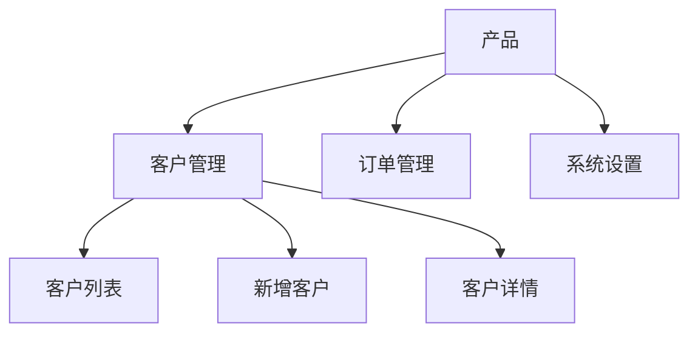
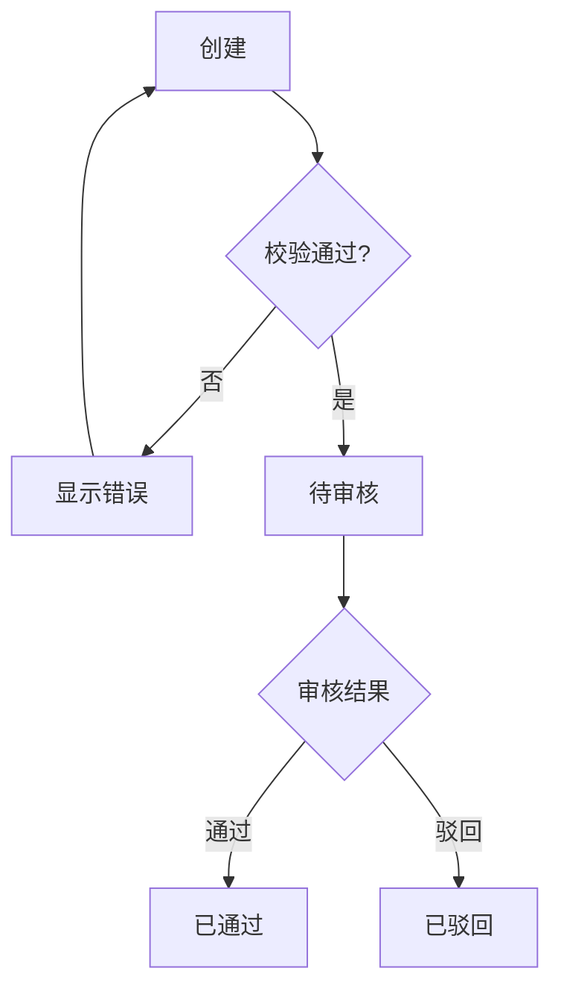
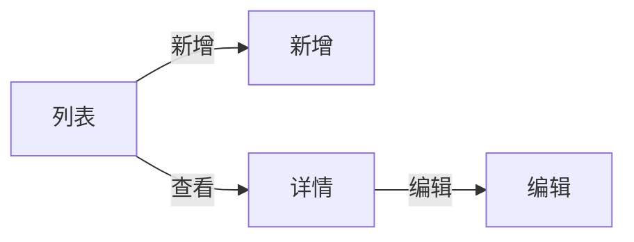
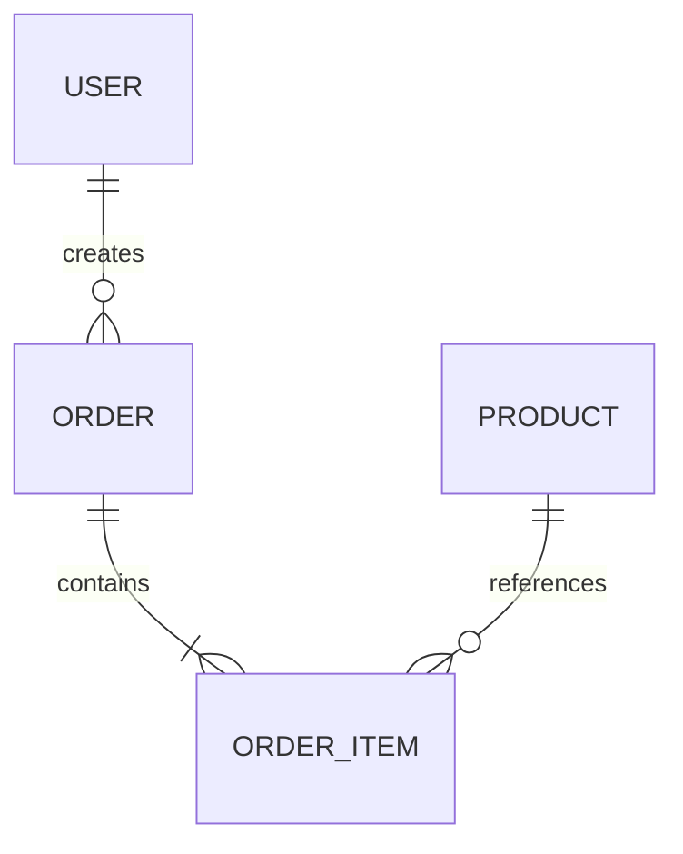

# Mermaid 图表规范

## 1. 使用范围

Mermaid 用于：
- 功能架构
- 信息架构
- Sitemap
- 页面跳转
- 用户流程
- 业务流程
- 审批流程
- 状态机
- 模块关系
- ER 图

## 2. 基本规则

1. 节点名称必须有业务含义。
2. 判断节点必须体现分支。
3. 关键失败路径必须考虑。
4. 重要流程不能只有 Happy Path。
5. 图后必须有文字规则。
6. 图中的关键节点必须在正文有定义。
7. 正文关键状态/流程不得在图中缺失。
8. 不确定节点标记“待确认”。

## 3. 功能架构

## 4. 业务流程

## 5. 页面跳转

## 6. ER 图

## 7. 图后规则

每张核心业务图后至少写：
- 前置条件
- 分支条件
- 状态变化
- 操作角色
- 异常处理
