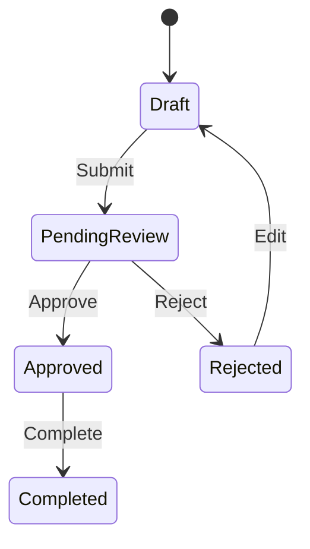

# 状态机规范

## 1. 适用对象

当对象存在生命周期时必须建立状态机，例如：
- 订单
- 合同
- 审批
- 工单
- 任务
- 发货单
- 退款
- 库存单

## 2. 必须定义

- 全部合法状态
- 初始状态
- 结束状态
- 状态变化操作
- 操作角色
- 前置条件
- 失败条件
- 是否可回退
- 是否可取消
- 是否允许重复操作

## 3. Mermaid

## 4. 状态表

| 当前状态 | 操作 | 条件 | 下一状态 | 操作角色 | 系统动作 |
|---|---|---|---|---|---|

## 5. 一致性

状态机必须与：
- 页面按钮
- 权限
- 业务规则
- 通知
- 验收标准
保持一致。

例如状态为“已完成”却仍出现“提交审核”按钮属于冲突。
